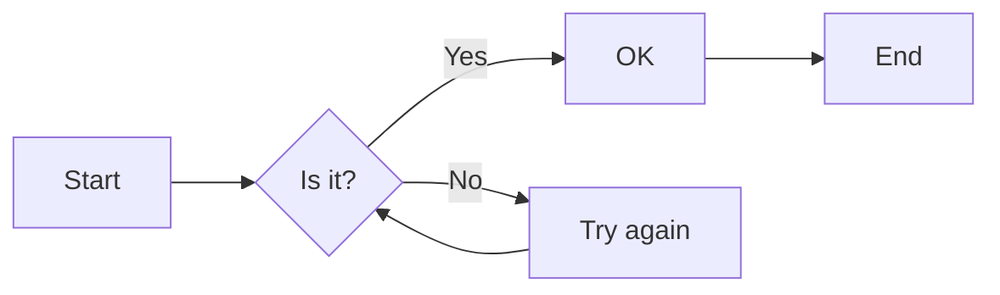

# Markdown Formalize: Hello World

Welcome to Markdown Formalize! This is a demo to show off some of its features. We hope you enjoy it!

Here's some **bold** text, some _italic_ text, and a [link to Google](https://www.google.com).

## Mermaid Diagrams

Here's a simple Mermaid diagram:



Isn't that neat? You can create diagrams directly from Markdown!

## LaTeX Equations

Let's try some LaTeX:

$$
E = mc^2
$$

Pretty cool, huh? Here's some inline LaTeX: $x = y + z$

## Syntax Highlighting

Code blocks with syntax highlighting are automatically formatted:

```javascript
function hello() {
    console.log("Hello, world!");
    return 42;
}

// This is a comment
const value = hello();
```

```python
def fibonacci(n):
    if n <= 1:
        return n
    else:
        return fibonacci(n-1) + fibonacci(n-2)

# Generate first 10 Fibonacci numbers
for i in range(10):
    print(fibonacci(i))
```

## Tables

Markdown tables are fully supported:

| Name    | Type    | Description            |
| ------- | ------- | ---------------------- |
| id      | Integer | Primary key            |
| name    | String  | User's full name       |
| email   | String  | User's email address   |
| created | Date    | Account creation date  |
| active  | Boolean | Whether user is active |

## Images

You can include images that will be embedded in the PDF:


Images can be local files or from remote URLs.

## Multilingual Support

### English

Markdown Formalize supports multiple languages with proper font rendering.

### Chinese (中文)

Markdown Formalize 支援多種語言，並提供正確的字體渲染。

### Japanese (日本語)

Markdown Formalizeは、正しいフォントレンダリングを備えた複数の言語をサポートしています。

### Korean (한국어)

Markdown Formalize는 올바른 글꼴 렌더링을 갖춘 여러 언어를 지원합니다.
